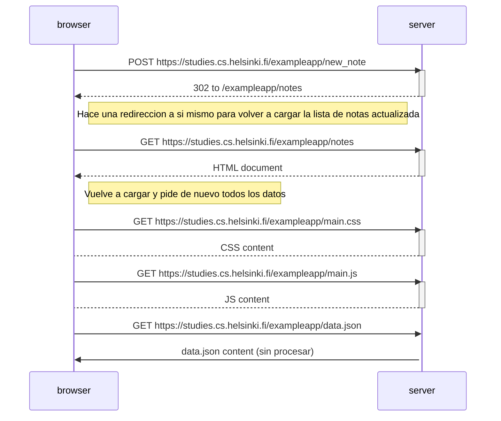

```mermaid
sequenceDiagram
    participant browser
    participant server

browser->> server: POST https://studies.cs.helsinki.fi/exampleapp/new_note
activate server
server-->>browser: 302 to /exampleapp/notes
deactivate server
Note left of server: Hace una redireccion a si mismo para volver a cargar la lista de notas actualizada

browser->>server: GET https://studies.cs.helsinki.fi/exampleapp/notes
activate server
server-->>browser: HTML document
deactivate server
note right of browser: Vuelve a cargar y pide de nuevo todos los datos

browser->> server: GET https://studies.cs.helsinki.fi/exampleapp/main.css
activate server
server --> browser: CSS content
deactivate server

browser->> server: GET https://studies.cs.helsinki.fi/exampleapp/main.js
activate server
server --> browser: JS content
deactivate server

browser ->> server: GET https://studies.cs.helsinki.fi/exampleapp/data.json
activate server
server ->> browser: data.json content (sin procesar)
```

