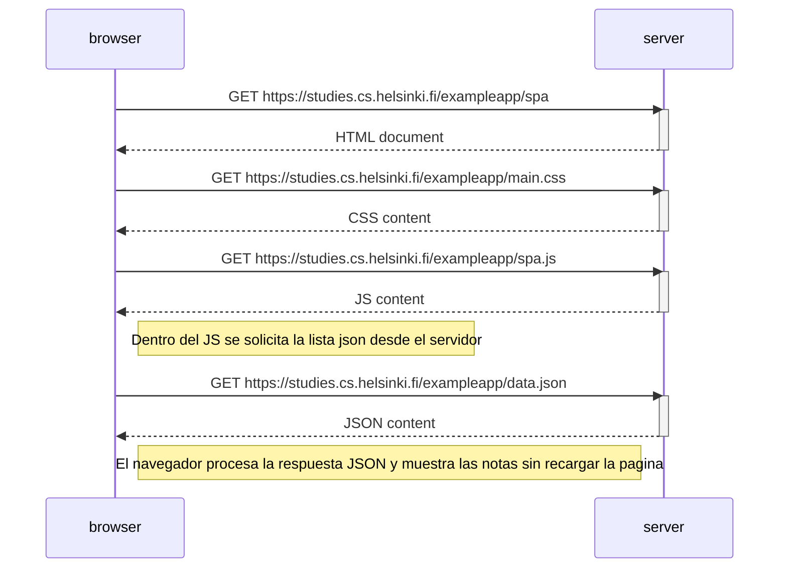

```mermaid
sequenceDiagram
    participant browser
    participant server

    browser->>server: GET https://studies.cs.helsinki.fi/exampleapp/spa
    activate server
    server-->>browser: HTML document
    deactivate server

    browser->>server: GET https://studies.cs.helsinki.fi/exampleapp/main.css
    activate server 
    server-->>browser: CSS content
    deactivate server

    browser ->> server: GET https://studies.cs.helsinki.fi/exampleapp/spa.js
    activate server 
    server -->> browser: JS content
    deactivate server 
    Note right of browser: Dentro del JS se solicita la lista json desde el servidor

    browser ->> server: GET https://studies.cs.helsinki.fi/exampleapp/data.json
    activate server 
    server -->> browser: JSON content
    deactivate server
    Note right of browser: El navegador procesa la respuesta JSON y muestra las notas sin recargar la pagina

```