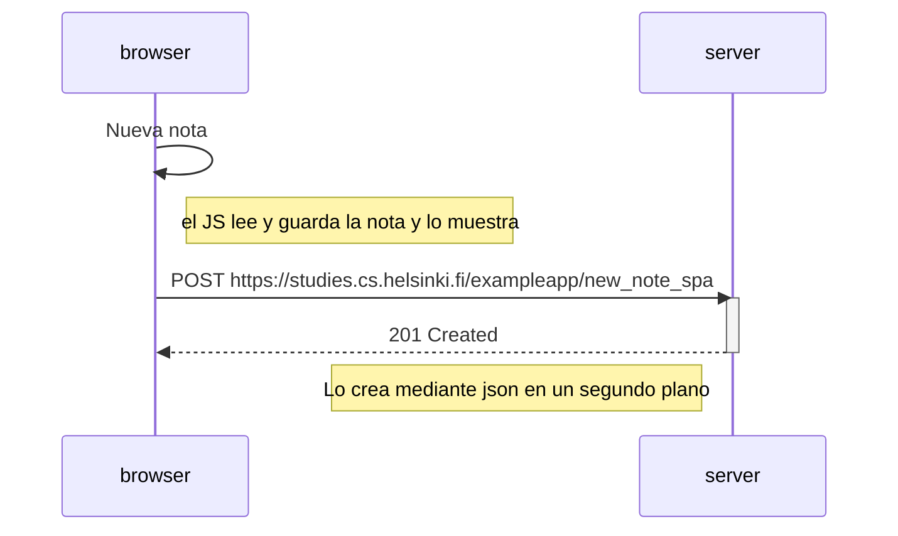

```mermaid
sequenceDiagram
    participant browser
    participant server

    browser->> browser: Nueva nota
    Note right of browser: el JS lee y guarda la nota y lo muestra

    browser->> server: POST https://studies.cs.helsinki.fi/exampleapp/new_note_spa
    activate server
    server-->>browser: 201 Created
    deactivate server
    Note left of server: Lo crea mediante json en un segundo plano
```